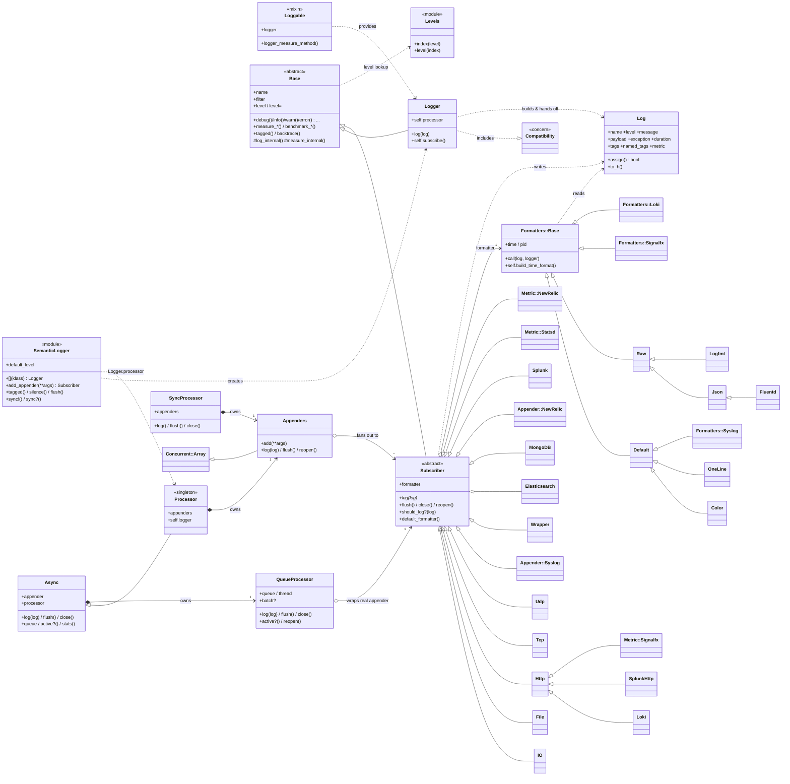

# Contributing

Welcome to Semantic Logger, great to have you on-board. :tada:

To get you started here are some pointers.

## Open Source

#### Early Adopters

Great to have you onboard, looking forward to your help and feedback.

#### Late Adopters

Semantic Logger is open source, maintained by the author and contributors in their spare time and offered
to the community free of charge. Please keep that in mind when raising issues or requesting features, since
there is no dedicated team available to take on custom work on demand.

If you have a specific need, particularly an edge case that is unique to your own environment or job, the
best way forward is to implement it yourself and open a Pull Request. Contributions of this kind are exactly
how the project grows, and they are warmly welcomed and appreciated.

## Documentation

Documentation updates are welcome and appreciated by all users of Semantic Logger.

The documentation is a Jekyll site under the `docs` subdirectory, published to [logger.rocketjob.io](https://logger.rocketjob.io).

#### Small changes

For a quick and fairly simple documentation fix the changes can be made entirely online in github.

1. Fork the repository in github.
2. Look for the markdown file that matches the documentation page to be updated under the `docs` subdirectory.
3. Click Edit.
4. Make the change and select preview to see what the changes would look like.
5. Save the change with a commit message.
6. Submit a Pull Request back to the Semantic Logger repository.

#### Complete Setup

To make multiple changes to the documentation, add new pages or just to have a real preview of what the
documentation would look like locally after any changes.

1. Fork the repository in github.
2. Clone the repository to your local machine.
3. Change into the documentation directory.

       cd semantic_logger/docs

4. Install required gems

       bundle update

5. Start the Jekyll server

       jekyll s

6. Open a browser to: http://127.0.0.1:4000

7. Navigate around and find the page to edit. The url usually lines up with the markdown file that
   contains the corresponding text.

8. Edit the files ending in `.md` and refresh the page in the web browser to see the change.

9. Once change are complete commit the changes.

10. Push the changes to your forked repository.

11. Submit a Pull Request back to the Semantic Logger repository.

## Code Changes

Since changes cannot be made directly to the Semantic Logger repository, fork it to your own account on Github.

1. Fork the repository in github.
2. Clone the repository to your local machine.
3. Change into the Semantic Logger directory.

       cd semantic_logger

4. Install required gems

       bundle update

5. Run tests

       bundle exec rake

   The test suite can also be run in synchronous mode, which logs on the calling thread instead of the
   background appender thread. This is useful when tracking down threading related issues.

       LOGGER_SYNC=1 bundle exec rake

   Some appender tests require MongoDB. The quickest way to provide one is to start the MongoDB container
   defined in `docker-compose.yaml`:

       docker-compose up -d mongodb

   By default the tests connect to `127.0.0.1:27017`. Set the `MONGO_HOST` environment variable to point at a
   MongoDB instance running elsewhere.

6. Run the linter

       bundle exec rubocop

   The minimum supported Ruby is 2.7, so please do not use syntax newer than that under `lib`.

7. When making a bug fix it is recommended to update the test first, ensure the test fails, and only then
   make the code fix.

8. Once the tests pass and all code changes are complete, commit the changes.

9. Push changes to your forked repository.

10. Submit a Pull Request back to the Semantic Logger repository.

## Philosophy

The defining trait of Semantic Logger is **asynchronous logging**. Log events are pushed onto an in-memory
queue that is serviced by a background thread, so the application is not blocked while logs are written to
one or more destinations ("appenders").

Logging is also **semantic**: in addition to a text message, every log event can carry a structured payload,
an exception, a duration, tags, named tags, and a metric. This structured data flows through the entire
pipeline so that each appender can render it in the form best suited to its destination, whether that is a
human readable line on the screen or structured JSON for a centralized logging service.

## Architecture

### Public vs internal API

The `SemanticLogger` module is the public interface, and everyone using Semantic Logger starts there,
typically with `SemanticLogger['ClassName']`, `SemanticLogger.add_appender`, or by including the `Loggable`
mixin. Once a `Logger` instance has been handed back, the methods on that returned logger (`info`,
`measure_info`, `tagged`, `level=`, and so on) are also part of the public interface.

Everything else is internal. End users never need to know how a `Logger` is constructed, or reach into
`Base`, `Processor`, `Subscriber`, `Appender::*`, `Formatters::*`, or `Log` directly. The classes shown
below are intended for contributors extending Semantic Logger, not for callers using it.

This keeps the API simple for everyone using Semantic Logger, and lets the internal classes change without
breaking existing code, since only the `SemanticLogger` module surface and the returned logger's methods are
guaranteed.

### The logging pipeline

The pipeline has four layers, and understanding the hand-off between them is the key to this codebase:

1. **`SemanticLogger::Logger`** is what application code holds, one per class. `logger.info(...)` builds a
   `Log` object and hands it to the one shared global processor.
2. **`SemanticLogger::Base`** is the abstract superclass of both `Logger` and `Subscriber`. It metaprograms
   the per-level methods (`debug`/`info`/`warn`/..., plus `measure_*`) and parses the flexible call
   signatures into a populated `Log`.
3. **`SemanticLogger::Processor`** is a singleton that *is* an `Appender::Async`, so it runs on a background
   thread with a queue (both owned by an internal `QueueProcessor`) and fans each `Log` out to the
   `Appenders` collection. `SyncProcessor` is the inline replacement used when `SemanticLogger.sync!` is
   called.
4. **`SemanticLogger::Subscriber`** is the abstract base class for all appenders. Each appender writes a
   `Log` to one destination using its own `Formatter`.

### Class diagram

The smaller appenders (`Bugsnag`, `Honeybadger`, `CloudwatchLogs`, `Kafka`, `Rabbitmq`, `Sentry`,
`OpenTelemetry`, and others) are left out of the diagram to keep it legible. They are all direct
`Subscriber` subclasses like the appenders shown above.

### Adding an appender

Each appender is a `Subscriber` subclass and must implement `#log(log)`, which writes a single `Log` to its
destination, usually after rendering it with `formatter.call(log, self)`. An appender may also implement
`#flush`, `#close`, `#reopen`, and `#batch` (implementing `#batch` makes the appender batched automatically).

Add the class under `lib/semantic_logger/appender/` and register it in the `autoload` list in
`lib/semantic_logger/appender.rb`. Appenders for third-party services keep their backing gem optional: it is
required lazily inside the appender, listed in the `Gemfile` for tests and in the `README.md`, but never
added to the `gemspec`.

### Adding a formatter

Each formatter is a `Formatters::Base` subclass (or any object that responds to `#call(log, logger)`). Add
the class under `lib/semantic_logger/formatters/` and register it in the `autoload` list in
`lib/semantic_logger/formatters.rb`.

## Contributor Code of Conduct

As contributors and maintainers of this project, and in the interest of fostering an open and welcoming community, we pledge to respect all people who contribute through reporting issues, posting feature requests, updating documentation, submitting pull requests or patches, and other activities.

We are committed to making participation in this project a harassment-free experience for everyone, regardless of level of experience, gender, gender identity and expression, sexual orientation, disability, personal appearance, body size, race, ethnicity, age, religion, or nationality.

Examples of unacceptable behavior by participants include:

* The use of sexualized language or imagery
* Personal attacks
* Trolling or insulting/derogatory comments
* Public or private harassment
* Publishing other's private information, such as physical or electronic addresses, without explicit permission
* Other unethical or unprofessional conduct.

Project maintainers have the right and responsibility to remove, edit, or reject comments, commits, code, wiki edits, issues, and other contributions that are not aligned to this Code of Conduct. By adopting this Code of Conduct, project maintainers commit themselves to fairly and consistently applying these principles to every aspect of managing this project. Project maintainers who do not follow or enforce the Code of Conduct may be permanently removed from the project team.

This code of conduct applies both within project spaces and in public spaces when an individual is representing the project or its community.

Instances of abusive, harassing, or otherwise unacceptable behavior may be reported by opening an issue or contacting one or more of the project maintainers.

This Code of Conduct is adapted from the [Contributor Covenant](http://contributor-covenant.org), version 1.2.0, available at [http://contributor-covenant.org/version/1/2/0/](http://contributor-covenant.org/version/1/2/0/)
