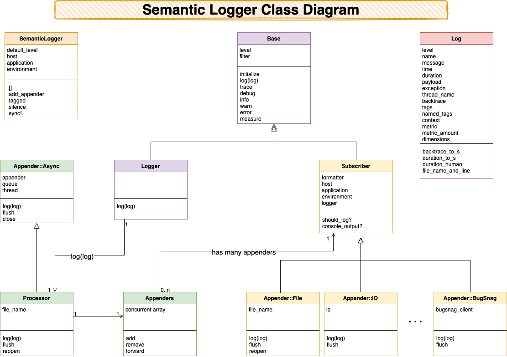

## Custom Formatters

The formatting for each appender can be replaced with custom code. To replace the existing
formatter, supply a block of code when creating the appender.

The formatter is called with two arguments: the log event, and the appender it is formatting for.
A block (Proc) may ignore the second argument and accept just the log event. For the structure of
the log event, see [Log Event](log_struct.html).

## Pattern Formatter

For simple layout changes there is no need to write a custom formatter class. The built-in
`:pattern` formatter builds each log line from a pattern string supplied directly in the
configuration.

Placeholders use the form `%{directive}`. To emit a literal `%{...}`, escape it as `%%{...}`.

~~~ruby
# A simple message-only format on stdout, for end users:
SemanticLogger.add_appender(
  io:        $stdout,
  formatter: {pattern: {pattern: "%{message}"}}
)

# A timestamped format to a file, at a different level:
SemanticLogger.add_appender(
  file_name: "application.log",
  level:     :debug,
  formatter: {pattern: {pattern: "%{time} %{level} %{name} -- %{message}"}}
)
~~~

The pattern is parsed once when the appender is created, so formatting every log entry is fast.
An unknown directive (or an argument supplied to a directive that does not take one) raises an
error immediately, when the appender is configured.

Available directives:

| Directive              | Description                                              |
|------------------------|----------------------------------------------------------|
| `%{time}`              | Formatted timestamp.                                     |
| `%{level}`             | Full level name, e.g. `debug`.                           |
| `%{level_short}`       | Single character level, e.g. `D`.                        |
| `%{name}`              | Logger / class name.                                     |
| `%{message}`           | Log message.                                             |
| `%{payload}`           | Payload rendered as a string.                            |
| `%{exception}`         | Exception class, message, and backtrace.                 |
| `%{duration}`          | Human readable duration, e.g. `1.2ms`.                   |
| `%{duration_ms}`       | Duration in milliseconds (numeric).                      |
| `%{thread_name}`       | Name of the thread that logged the message.              |
| `%{pid}`               | Process id.                                              |
| `%{file_name_and_line}`| Ruby file name and line number, e.g. `app.rb:42`.        |
| `%{tags}`              | Tags, comma separated.                                   |
| `%{named_tags}`        | All named tags. One tag with `%{named_tags:request_id}`. |
| `%{host}`              | Host name.                                               |
| `%{application}`       | Application name.                                        |
| `%{environment}`       | Environment name.                                        |

When the pattern is omitted it defaults to a layout similar to the default text formatter:
`%{time} %{level} [%{pid}:%{thread_name}] %{name} -- %{message}`.

For anything the pattern formatter cannot express, supply custom code instead.

#### Example: Formatter that just returns the log event

~~~ruby
require "semantic_logger"

SemanticLogger.default_level = :trace

formatter = Proc.new do |log|
  # This formatter just returns the log event as a string
  log.inspect
end
SemanticLogger.add_appender(io: $stdout, formatter: formatter)

logger = SemanticLogger["Hello"]
logger.info "Hello World"
~~~
Output:

    #<SemanticLogger::Log:0x00007f8a1b0c2d40 @level=:info, @thread_name="70167090649820", @name="Hello", @time=2012-10-24 10:09:33 -0400, @tags=[], @named_tags={}, @level_index=2, @message="Hello World", @payload=nil, @duration=nil, @metric=nil, @metric_amount=nil, @dimensions=nil>


#### Example: Replace the default log file formatter

~~~ruby
require "semantic_logger"
SemanticLogger.default_level = :trace
~~~

Create a custom formatter:
~~~ruby
class MyFormatter < SemanticLogger::Formatters::Default
  # Return the complete log level name in uppercase
  def level
    log.level.upcase
  end
end
~~~

Specify the formatter when creating the appender:
~~~ruby
SemanticLogger.add_appender(file_name: "development.log", formatter: MyFormatter.new)
~~~

Example usage:
~~~ruby
Rails.logger.info "Hello World"

# => 2017-04-05 01:05:52.868286 INFO [13143:70216759638540 (irb):11] Rails -- Hello World
~~~

See [SemanticLogger::Formatters::Default](https://github.com/reidmorrison/semantic_logger/blob/master/lib/semantic_logger/formatters/default.rb) for all the methods that can be replaced to customize the output.

#### Example: Replace the colorized log file formatter

~~~ruby
require "semantic_logger"
SemanticLogger.default_level = :trace
~~~

Create a custom formatter:
~~~ruby
class MyFormatter < SemanticLogger::Formatters::Color
  # Return the complete log level name in uppercase
  def level
    "#{color}#{log.level.upcase}#{color_map.clear}"
  end
end
~~~

Specify the formatter when creating the appender:
~~~ruby
SemanticLogger.add_appender(file_name: "development.log", formatter: MyFormatter.new)
~~~

Example usage:
~~~ruby
Rails.logger.info "Hello World"

# => 2017-04-05 01:05:52.868286 INFO [13143:70216759638540 (irb):11] Rails -- Hello World
~~~

See [SemanticLogger::Formatters::Color](https://github.com/reidmorrison/semantic_logger/blob/master/lib/semantic_logger/formatters/color.rb) for all the methods that can be replaced to customize the output.

#### Example: Replacing the format for an active logger, such as in Rails:

This example assumes you have `gem "rails_semantic_logger"` in your Gemfile.

Create a file called `config/initializers/semantic_logger.rb`:

~~~ruby
# Find file appender:
appender = SemanticLogger.appenders.find{ |a| a.is_a?(SemanticLogger::Appender::File) }

appender.formatter = MyFormatter.new
~~~

#### Example: Do not log the process ID

When running docker containers with a single process which is always 1, or when running only one
process on a server the PID ( Process ID ) is not relevant.

To leave out the pid, we can use a custom formatter:

```ruby
class NoPidFormatter < SemanticLogger::Formatters::Default
  # Leave out the pid
  def pid
  end
end
```

Specify the formatter when creating the appender:

```ruby
SemanticLogger.add_appender(file_name: "development.log", formatter: NoPidFormatter.new)
```

Or to use the colorized formatter, use `SemanticLogger::Formatters::Color` instead of 
`SemanticLogger::Formatters::Default`.

Or if the appender is already installed:
```ruby
SemanticLogger.appenders.first.formatter = NoPidFormatter.new
```

## Escaping Control Characters

By design, the human readable text formatters (`:default` and `:color`) write log
messages exactly as supplied, including newlines and ANSI color codes. This is
intentional and useful: multi-line messages and colorized output make local logs
easier to read.

When log messages can contain untrusted, attacker-controlled data (for example a
user name, request parameter, or `User-Agent` header), those same characters can be
abused. A newline can forge an additional, fake log entry ("log forging"), and an
ANSI escape sequence can spoof or hide terminal output when the log is viewed in a
terminal.

Structured formatters such as `:json` are not affected, because JSON encoding always
escapes control characters. They are the recommended choice when forwarding logs that
may contain untrusted data to a centralized logging system.

For the text formatters, enable the `escape_control_chars` option to replace control
characters in untrusted log data (the message, tags, named tags, and exception
message) with a printable, escaped form. For example a newline is written as `\n` and
the ANSI escape as `\e`. The option is **disabled by default** to preserve the
existing human readable output, so newlines and colors continue to work unless you opt
in.

```ruby
# Text appender that escapes control characters in untrusted data:
SemanticLogger.add_appender(file_name: "production.log", formatter: {default: {escape_control_chars: true}})

# Colorized appender, still escaping control characters in the logged data
# (the formatter's own color codes are preserved):
SemanticLogger.add_appender(io: $stdout, formatter: {color: {escape_control_chars: true}})
```

The option only escapes the control characters in the logged data; it does not touch
the formatter's own decoration, so the `:color` formatter keeps emitting its color
codes. Multi-line exception backtraces are also preserved, since they are generated by
Semantic Logger rather than supplied as log data.

## Custom Appender

To write your own log appender it should meet the following requirements:

* Inherit from `SemanticLogger::Subscriber`
* In the initializer connect to the resource being logged to
* Implement #log(log) which needs to write to the relevant resource
* Implement #flush if the resource can be flushed
* Write a test for the new appender

The `#log` method receives the log event as its parameter.
For the structure of the log event, see [Log Event](log_struct.html).

Basic outline for an Appender:

~~~ruby
require "semantic_logger"

class SimpleAppender < SemanticLogger::Subscriber
  attr_reader :host
  
  # Add additional arguments to the initializer while supporting all existing ones.
  def initialize(host: host, **args, &block)
    @host = host
    super(**args, &block)
  end

  # Display the log struct and the text formatted output
  def log(log)
    # Display the raw log structure
    p log

    # Display the formatted output
    puts formatter.call(log, self)
  end

  # Optional
  def flush
    puts "Flush :)"
  end

  # Optional
  def close
    puts "Closing :)"
  end
end
~~~

Sample program calling the above appender:

~~~ruby
SemanticLogger.default_level = :trace
# Log to file dev.log
SemanticLogger.add_appender(file_name: "dev.log")
# Also log the above sample appender
SemanticLogger.add_appender(appender: SimpleAppender.new)

logger = SemanticLogger["Hello"]
logger.info "Hello World"
~~~

Look at the [existing appenders](https://github.com/reidmorrison/semantic_logger/tree/master/lib/semantic_logger/appender) for good examples

### Tests

To have your custom appender included in the standard list of appenders, submit it along
with complete working tests.
See the [Graylog Appender Test](https://github.com/reidmorrison/semantic_logger/blob/master/test/appender/graylog_test.rb) for an example.

## Design

This section introduces the internal design of Semantic Logger, which will be helpful for anyone
that wants to contribute changes for others in the community to take advantage of.

### Log message flow diagram

Shows how log messages events are emitted from the various log instances, placed in the in-memory queue,
and then written to one or more appenders on a separate thread.


### Class Diagram



### [Next: Security ==>](security.html)
