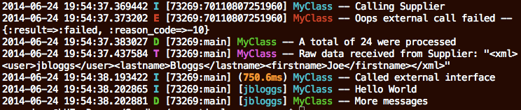

Semantic Logger is a comprehensive logging interface that enables human and machine readable logging outputs.

* Colorful text log files for humans to read.
* JSON log files containing all Semantic information that machines can easily comsume. 
* Write to multiple output destinations at the same time.
* Forward logs to a centralized logging system, via JSON output or built-in appenders.

Semantic Logger adds contextual information to every log entry:

* Name
    * Name of the class that logged the message.
    * Know quickly where a log message came from.
* File name
    * Name of the Ruby source code file that logged the message.
* File line number
    * Line number in the Ruby source code file that logged the message.
* Duration
    * How long did a block of code take to complete.
* Exceptions
    * Natively capture and forward exceptions in their original form along with the complete backtrace.
    * Include child or caused-by exception information.
* Thread name
    * Name threads so that their log messages can be easily isolated, or compared against other threads.
* Process ID
    * Know which process wrote every log message.
* Metrics
    * Add named metrics to specific log messages.
    * Forward metrics so that dashboards and alerts can be created based on specific metrics.
    * Example, forward to NewRelic, Splunk, etc.
* Tagging
    * Tag all log entries within a block of code with common information.
    * Example, all log entries for a specific web request, or user.
* Custom Fields
    * For example, user id, login, session id, roles, etc.

Example:

~~~ruby
logger.info("Queried users table in #{duration} ms, with a result code of #{result}")
~~~

Example, including semantic information:

~~~ruby
logger.info('Queried table',
  duration: duration,
  result:   result,
  table:    'users',
  action:   'query')
~~~

## Features

### Colorize log files

* Use color to quickly identify error messages vs informational messages.

### Implementation

* Direct replacement for the Ruby, and Rails loggers.
    * Conforms to the common logging interface.
* Easy to switch to Semantic Logger. 
    * Only change how the logger is created.
    * For Rails, just add the `rails_semantic_logger` gem.

### Benchmarking

* Measure and log the duration of a block of code.
* Set a duration threshold that needs to be exceeded before a measure message is logged.
    * Quickly identify the cause of system slowdowns when these log messages start appearing.
* Automatically log unhandled exceptions raised during measured blocks.

### Metrics

* Supply metrics to any measured block and have the metric automatically forwarded to
  all registered metrics listeners.
* Metrics can be rendered in New Relic, statsd / graphite, and/or other dashboards.

### Centralized Logging

* Centralized log data store.
* Analytics and search dashboard.

### Dynamic

* Increase the log level at runtime, or for just one class at a time.
    * Example: Increase the log level for a client library to log the messages sent and received.
* Change the log level for a process using signals without restarting it.

### Tags & Named Tags

* Add custom tags to every log entry within a block of code,
  including third party libraries and gems.
* Associate all log entries with a user, session, or call across all applicable threads.
* Add named tags (Hash) to every log message, allowing data stores to search for log messages 
  based on any value in the hash payload, such as user name, transaction id etc.

### Exceptions

* Log all exception data, including child and caused by exceptions.

### High Performance

* Supports logging from hundreds of concurrent threads in the same process.
* Logging is performed in a separate thread so as not to slow down the application
  whilst logging to one or more destinations.

### Thread Safe

* Semantic Logger is completely thread safe and all methods can be called
  concurrently from any thread.
* Tagged logging keeps any tagging data on a per-thread basis to ensure that
  tags from different threads are not inter-mingled.
* Supports highly concurrent environments running hundreds of threads.
* Each appender writes all log entries sequentially in the appender thread so
  that log entries are written in the correct sequence.
* Avoids issues that other loggers experience when multiple threads try to write
  to the same log file at the same time creating partial and overwritten log
  entries in the log file.

### Thread Aware

* Includes the process id, and thread name in every log entry so that
  log entries from different processes and threads are quickly discernible and searchable.
* Assign names to every thread for logging purposes.

### Trace Level

* Log detailed trace information such as data sent or received at `:trace` level
* Since `:trace` can be enabled on a per class basis it can be enabled
  in production to log what was actually sent to an external vendor to assist with
  problem determination.

### Multiple Destinations

* Log to multiple destinations at the same time ( File and MongoDB, etc.. )
* Each destination can also have its own log level.
  For example, only log :info and above to MongoDB, or :warn and above to a
  second log file.

### Customizable

* The format of messages can be customized for every appender / destination.
* Easily create custom appenders and formatters to send log data to other data stores,
  such as Hadoop, Redis, etc..

## Example:

~~~ruby
require 'semantic_logger'

# Set the global default log level
SemanticLogger.default_level = :trace

# Log to a file, and use the colorized formatter
SemanticLogger.add_appender(file_name: 'development.log', formatter: :color)

# Create an instance of a logger
# Add the application/class name to every log message
logger = SemanticLogger['MyClass']
~~~

Informational logging

~~~ruby
logger.info("Calling Supplier")
~~~

Error information

~~~ruby
logger.error("Oops external call failed", :result => :failed, :reason_code => -10)
~~~

Set this thread's name for when multiple threads are all logging at the same time

~~~ruby
Thread.current.name = "main"
~~~

Debug information

~~~ruby
results = [ 5, 7, 2, 10 ]
logger.debug { "A total of #{results.inject(0) {|sum, i| i+sum }} were processed" }
~~~

New level for logging low level trace information such as data sent or received

~~~ruby
raw_response = "<xml><user>jbloggs</user><lastname>Bloggs</lastname><firstname>Joe</firstname></xml>"
logger.trace "Raw data received from Supplier:", raw_response
~~~

Measure and log how long it takes to execute a block of code

~~~ruby
logger.measure_info "Called external interface" do
  # Code to call external service ...
  sleep 0.75
end
~~~

Add tags to every log entry within the code block. For example login, session id, source ip address, username, etc.

~~~ruby
logger.tagged('jbloggs') do
  # All log entries in this block will include the tag 'jbloggs'
  logger.info("Hello World")
  logger.debug("More messages")
end
~~~

Output:

### Ruby Support

For the complete list of supported Ruby versions, see
the [Testing file](https://github.com/reidmorrison/semantic_logger/blob/master/.travis.yml).

### [Next: Rails ==>](rails.html)
