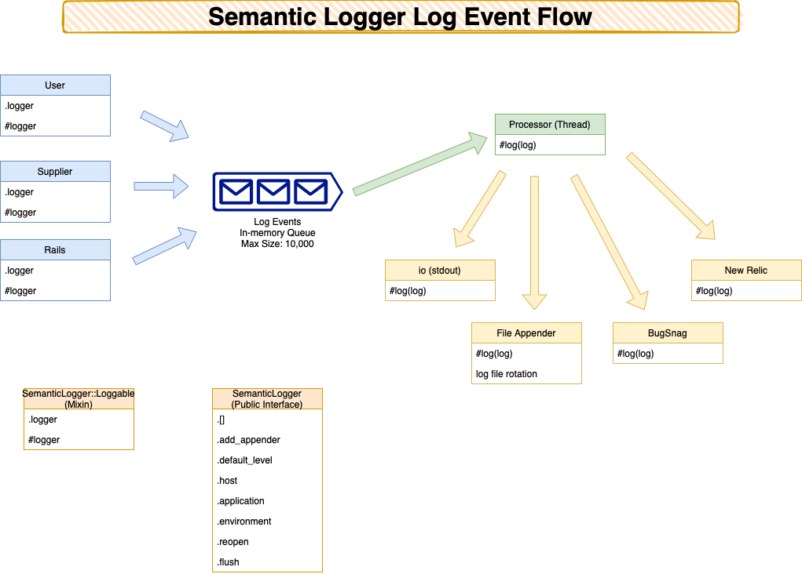

## What is Semantic Logger?

Semantic Logger is a feature rich logging framework for Ruby, and a replacement
for the built-in Ruby and Rails loggers.

It does two things that ordinary loggers do not:

1. **It logs structured data, not just strings.** Along with the usual text message you can
   attach a payload (any Hash), an exception, a duration, metrics, and tags. That data is
   preserved all the way to the destination, so it stays searchable instead of being flattened
   into a line of text.
2. **It logs asynchronously.** Log events are placed on an in-memory queue and written to their
   destinations by a separate background thread. Your application is not blocked while logs are
   written to disk, a database, or a remote service.

If you are using Rails, use the companion gem
[rails_semantic_logger](https://github.com/reidmorrison/rails_semantic_logger), which replaces
the Rails logger automatically. See the [Rails guide](rails.html).

## Why use it?

### The problem with traditional logging

With the standard Ruby logger you eventually end up building messages by hand:

~~~ruby
logger.info("Queried users table in #{duration} ms, with a result code of #{result}")
~~~

That reads fine for a human, but to a machine it is just a string. To answer a question like
"show me every query that took longer than 100 ms" you have to write fragile regular expressions
against your log files, and every developer formats their messages slightly differently.

### The Semantic Logger way

Log the message and the data separately:

~~~ruby
logger.info("Queried users table",
  duration: duration,
  result:   result,
  table:    "users",
  action:   "query")
~~~

Now the same event is still readable by a human, but a machine can index `duration`, `result`,
`table`, and `action` as real fields. Send it to a JSON file, Elasticsearch, or Splunk and you can
search, filter, and build dashboards on those fields directly, no log parsing required.

### Reasons developers choose Semantic Logger

* **Fast.** Logging happens on a background thread, so even logging thousands of lines per second
  does not slow your application down. See [how it works](#how-it-works) below.
* **Structured.** Every log entry can carry a payload, exception, duration, metrics, and tags
  without losing that structure.
* **Human and machine readable at the same time.** Colorized text for developers, JSON for your
  log aggregator, written from the same log call.
* **Many destinations at once.** Write to a file, the screen, and a remote service simultaneously,
  each with its own log level and format. See [Appenders](appenders.html).
* **A familiar API.** It supports the standard `debug`/`info`/`warn`/`error`/`fatal` API, so
  existing code and other gems keep working. You mostly just change how the logger is created.
* **Built for production.** Per-class log levels, change the log level of a running process with a
  [signal](signals.html), tagged logging for tracing requests across threads, automatic exception
  capture, and [metrics](metrics.html) for dashboards.

## Quick start

Install the gem:

~~~bash
gem install semantic_logger
~~~

Or add it to your `Gemfile`:

~~~ruby
gem "semantic_logger"
~~~

Configure it once when your application starts, then log:

~~~ruby
require "semantic_logger"

# Log :info and above. Use :trace, :debug, :info, :warn, :error, or :fatal.
SemanticLogger.default_level = :info

# Send log output to the screen using the colorized formatter.
SemanticLogger.add_appender(io: $stdout, formatter: :color)

# Create a logger for the current class. The class name is added to every message.
logger = SemanticLogger["MyApp"]

logger.info("Application started")
~~~

That is the whole setup. The [Programmer's Guide](api.html) covers the full logging API.

## A tour of the features

The examples below assume you already have a `logger` from `SemanticLogger["MyApp"]`.

#### Log a message with structured data

~~~ruby
logger.error("Outbound call failed", result: :failed, reason_code: -10)
~~~

#### Log an exception

Pass the exception directly. The class, message, and backtrace are all captured, including any
nested "caused by" exceptions.

~~~ruby
begin
  # ... code that may raise
rescue => exception
  logger.error("Import failed", exception)
end
~~~

#### Only evaluate expensive messages when needed

Pass a block. It runs only when the log level is active, so it is skipped entirely in production
when the level is higher.

~~~ruby
logger.debug { "Processed a total of #{records.sum(&:size)} bytes" }
~~~

#### Measure how long something takes

The message is written when the block completes, together with its duration. If the block raises,
the exception is logged with the duration and then re-raised.

~~~ruby
logger.measure_info("Called external interface") do
  # Code to call the external service ...
end
~~~

#### Tag a block of related log entries

Every log entry inside the block carries the tags, which is invaluable for tracing one request
across many classes and threads.

~~~ruby
SemanticLogger.tagged(user: "jbloggs", request_id: "abc123") do
  logger.info("Hello World")
  logger.debug("More detail")
end
~~~

#### Name your threads

So concurrent log entries are easy to tell apart.

~~~ruby
Thread.current.name = "worker-1"
~~~

## How it works

Every logger forwards its log events to a single, shared background thread through an in-memory
queue. That thread writes each event to every registered appender (destination) in turn. Because
the writing happens off to the side, the thread that called `logger.info` returns immediately.

This design is why Semantic Logger is both fast and thread safe: log calls from hundreds of
concurrent threads simply enqueue events, and each appender writes them out sequentially in the
correct order. For the rare cases where you want logging to happen inline on the calling thread,
see [Synchronous Operation](api.html#synchronous-operation).

### Non-blocking (dropping) mode

By default the in-memory queue is capped (`max_queue_size`, default `10,000`). When the queue is
full, for example because an appender cannot keep up, calls to `logger.info` block until space
becomes available. This guarantees no log message is lost, at the cost of (briefly) slowing down
the application.

For workloads where application availability matters more than complete logs, enable
`non_blocking` so that log messages are dropped instead of blocking the calling thread once the
queue is full:

~~~ruby
SemanticLogger.add_appender(
  file_name:    "production.log",
  async:        true,
  non_blocking: true
)
~~~

When messages are dropped, the count is logged to the internal logger at most once every
`dropped_message_report_seconds` (default `30`) so that dropped messages do not go unnoticed:

~~~ruby
SemanticLogger.add_appender(
  file_name:                      "production.log",
  async:                          true,
  non_blocking:                   true,
  dropped_message_report_seconds: 60
)
~~~

`non_blocking` only applies to a capped queue; an uncapped queue (`max_queue_size: -1`) never
blocks and never drops, but can grow without bound.

### Ruby Support

For the complete list of supported Ruby versions, see
the [Testing file](https://github.com/reidmorrison/semantic_logger/blob/master/.github/workflows/ci.yml).

### [Next: Rails ==>](rails.html)
