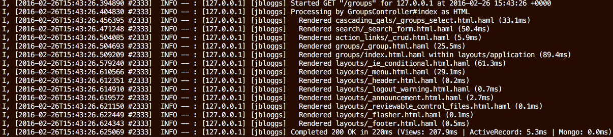
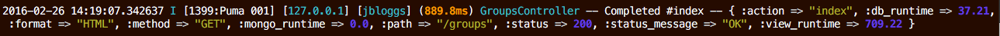
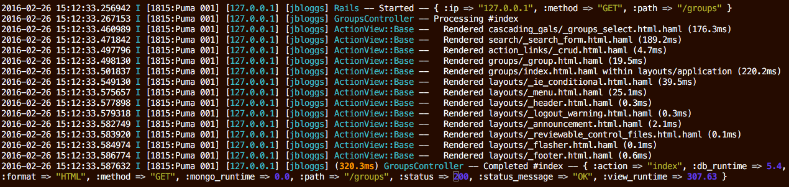
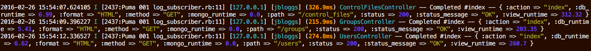

## Rails

The `rails_semantic_logger` gem replaces the default Rails logger with Semantic Logger.
It also reduces Rails logging output in production to almost a single line
for every Controller-Action call.

#### Standard Rails log output for a single page request

#### Rails log output for the same single page request after adding the `rails_semantic_logger` gem:

#### Re-enable Started, Processing, and Rendered messages

~~~ruby
config.rails_semantic_logger.started    = true
config.rails_semantic_logger.processing = true
config.rails_semantic_logger.rendered   = true
~~~

#### Original Rails messages with semantic logger formatting

~~~ruby
config.rails_semantic_logger.semantic   = false
config.rails_semantic_logger.started    = true
config.rails_semantic_logger.processing = true
config.rails_semantic_logger.rendered   = true
~~~

#### Include the file name and line number in the source code where the message originated

~~~ruby
config.semantic_logger.backtrace_level = :info
~~~

The above output shows 3 web requests where the source file name was `log_subscriber.rb` and line number `11`.

### Disable default Rails file logging

When running in an environment where local file logging is not available, or to completely replace the file logger,
disable the default rails file logging by setting:

~~~ruby
config.rails_semantic_logger.add_file_appender = false
~~~

After disabling the default file logging another appender needs to be added before any logging will be sent anywhere.
For example to create a JSON only log file:

~~~ruby
config.semantic_logger.add_appender(file_name: 'log/json.log', formatter: :json)
~~~

Note: If the default file logger is not used then any logging failures will be written to stderror.

### Rails Support

* Supports Rails 3.2, 4, & 5 ( or above )

### Installation

Add the following lines to Gemfile

~~~ruby
gem 'awesome_print'
gem 'rails_semantic_logger'
~~~

The gem `awesome_print` is optional, but is recommended to get colorized output of semantic data
(Hash output).

Install required gems with bundler

    bundle install

This will automatically replace the standard Rails logger with Semantic Logger
which will write all log data to the configured Rails log file.

### Configuration

The configuration can be set in either `config/application.rb` or the environment specific file in
`config/environments`.

#### Log Level

To change the log level:

~~~ruby
# Set to the log level to :trace, :debug, :info, :warn, :error, or :fatal
config.log_level = :debug
~~~

#### Quiet asset logging

Rails logs asset retrievals at the debug level. These log entries can quickly clutter the log output:

~~~
Rack -- Started -- {:ip => "127.0.0.1", :method => "GET", :path => "/assets/rocket_job_mission_control/rocket-icon-64x64.png"}
~~~

To turn off the asset logging:

~~~ruby
config.rails_semantic_logger.quiet_assets = true
~~~

#### Colorize Logging

If the Rails colorized logging is enabled, then the colorized formatter will be used
by default. To disable colorized logging in both Rails and Semantic Logger:

~~~ruby
config.colorize_logging = false
~~~

#### Semantic log output

By default Action Controller and Active Record text messages are converted to semantic data (Hash):

~~~
Rack -- Started -- { :ip => "127.0.0.1", :method => "GET", :path => "/users" }
UserController -- Completed #index -- { :action => "index", :db_runtime => 54.64, :format => "HTML", :method => "GET", :mongo_runtime => 0.0, :path => "/users", :status => 200, :status_message => "OK", :view_runtime => 709.88 }
~~~

To disable semantic message conversion:

~~~ruby
config.rails_semantic_logger.semantic = false
~~~

#### Started message

By default the Started message is logged at the debug level so that it does not appear in production.

~~~
Rack -- Started -- { :ip => "127.0.0.1", :method => "GET", :path => "/users" }
~~~

To show Rack started messages in production:

~~~ruby
config.rails_semantic_logger.started = true
~~~

#### Processing message

By default the Controller Processing message is logged at the debug level so that it does not appear in production.

~~~
UserController -- Processing #index
~~~

To show the Controller Processing message in production:

~~~ruby
config.rails_semantic_logger.processing = true
~~~

#### Vew Rendering messages

By default the Action View rendering messages are logged at the debug level so that they do not appear in production.

~~~
ActionView::Base --   Rendered data/search/_user.html.haml (46.7ms)
~~~

To show the Action View rendering messages in production:

~~~ruby
config.rails_semantic_logger.rendered = true
~~~

#### Awesome Print Options

The default Awesome Print options can be changed by supplying any valid Awesome Print options:

~~~ruby
config.rails_semantic_logger.ap_options = {multiline: false}
~~~

The defaults can also changed be creating a `~/.aprc` file.
See the [Awesome Print Options Documentation](https://github.com/michaeldv/awesome_print)

Notes:

* The option :multiline is set to false if not supplied.
* Has no effect if Awesome Print is not installed.

#### Adding custom data to the Rails Completed log message

During Controller-action processing custom data can be added to the Rails Completed message.

Add a method called `append_info_to_payload` to the controller to modify the payload that is logged:

~~~ruby
class ThingController
  private

  def append_info_to_payload(payload)
    super
    payload[:user_id] = 42
  end
end
~~~

#### Log file name and line number

In development to log the file and line number from which every log message originated:

~~~ruby
# Log file name and line number for log messages at this level and above
config.semantic_logger.backtrace_level = :debug
~~~

By default backtraces are only captured for `:error` and `:fatal` levels since capturing a backtrace
for every log message is expensive.

This feature can be used in production, but use care since setting the level too low will slow down the application.

### Process Forking

Also see [Process Forking](forking.html) if you use Unicorn or Puma

### MongoDB logging

To log to both the Rails log file and MongoDB add the following lines to
config/environments/production.rb inside the Application.configure block

~~~ruby
require 'mongo'
config.after_initialize do
  # Re-use the existing MongoDB connection, or create a new one here
  db = Mongo::MongoClient.new['production_logging']

  # Besides logging to the standard Rails logger, also log to MongoDB
  appender = SemanticLogger::Appender::MongoDB.new(
    db:              db,
    collection_name: 'semantic_logger',
    collection_size: 25.gigabytes
  )
  config.semantic_logger.add_appender(appender: appender)
end
~~~

### Logging to Syslog

Configuring rails to also log to a local Syslog:

~~~ruby
config.after_initialize do
  config.semantic_logger.add_appender(appender: syslog)
end
~~~

Configuring rails to also log to a remote Syslog server such as syslog-ng over TCP:

~~~ruby
config.after_initialize do
  config.semantic_logger.add_appender(appender: syslog, url: 'tcp://myloghost:514')
end
~~~

### Log Rotation

Since the log file is not re-opened with every call, when the log file needs
to be rotated, use a copy-truncate operation over deleting the file.

Sample Log rotation file for Linux:

~~~
/var/www/rails/my_rails_app/shared/log/*.log {
        daily
        missingok
        copytruncate
        rotate 14
        compress
        delaycompress
        notifempty
}
~~~

### Custom Appenders and Formatters

The format of data logged by Semantic Logger is specific to each appender.

To change the text file log format in Rails Semantic Logger, create a rails initializer with the following code and customize as needed.
For example: 'config/initializers/semantic_logger_formatter.rb'

~~~ruby
# Replace the format of the existing log file appender
SemanticLogger.appenders.first.formatter = Proc.new do |log|
  colors      = SemanticLogger::AnsiColors
  level_color = colors::LEVEL_MAP[log.level]

  # Header with date, time, log level and process info
  message     = "#{log.formatted_time} #{level_color}#{log.level_to_s}#{colors::CLEAR} [#{log.process_info}]"

  # Tags
  message << ' ' << log.tags.collect { |tag| "[#{level_color}#{tag}#{colors::CLEAR}]" }.join(' ') if log.tags && (log.tags.size > 0)

  # Duration
  message << " (#{colors::BOLD}#{log.duration_human}#{colors::CLEAR})" if log.duration

  # Class / app name
  message << " #{level_color}#{log.name}#{colors::CLEAR}"

  # Log message
  message << " -- #{log.message}" if log.message

  # Payload: Colorize the payload if the AwesomePrint gem is loaded
  if log.has_payload?
    payload = log.payload
    message << ' -- ' <<
      if !defined?(AwesomePrint) || !payload.respond_to?(:ai)
        payload.inspect
      else
        payload.ai(multiline: false) rescue payload.inspect
      end
  end

  # Exceptions
  if log.exception
    message << " -- Exception: #{colors::BOLD}#{log.exception.class}: #{log.exception.message}#{colors::CLEAR}\n"
    message << log.backtrace_to_s
  end
  message
end
~~~

### Replacing Existing loggers

Rails Semantic Logger automatically replaces the default loggers for the following gems
after they have been initialized:

- Sidekiq
- Resque
- Mongoid
- MongoMapper
- Moped
- Bugsnag

### [Next: Centralized Logging ==>](centralized_logging.html)
