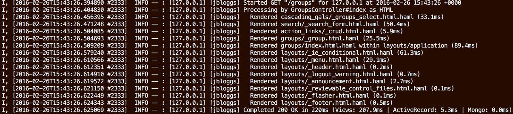
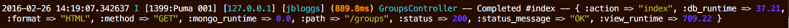
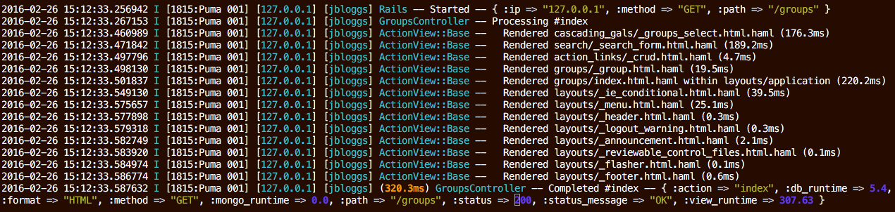
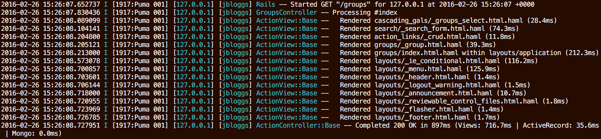
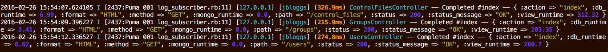

## Rails

[rails_semantic_logger](https://github.com/reidmorrison/rails_semantic_logger) is a companion gem
that wires Semantic Logger into Rails for you. Once installed it:

* Replaces the default Rails logger with Semantic Logger, so Rails, your application code, and many
  common gems all log through it.
* Collapses the several lines Rails normally logs per request into a single, structured "Completed"
  line, while keeping the individual fields (controller, action, status, durations, and so on)
  searchable.
* Lets you send logs anywhere Semantic Logger supports: the standard Rails log file, standard out as
  JSON for a container platform, a centralized log service, or several of these at once.

This page is a step-by-step guide that assumes no prior knowledge of either gem. Work through it
top to bottom: each section builds on the previous one. For the underlying logging API (logging
methods, tags, metrics, and so on) see the [Programmer's Guide](api.html), and for the full catalog
of log destinations see [Appenders](appenders.html).

> **Upgrading from v4?** The way appenders (log destinations) are configured changed in v5. Jump to
> [Migrating from v4 to v5](#migrating-from-v4-to-v5), then come back here.

### Requirements

Rails Semantic Logger v5 requires **Ruby 3.2 or later** and **Rails 7.2 or later**. For the exact
list of tested Ruby and Rails versions, see the
[CI workflow](https://github.com/reidmorrison/rails_semantic_logger/blob/master/.github/workflows/ci.yml).

### Installation

Add the following lines to your `Gemfile`:

~~~ruby
gem "rails_semantic_logger"
gem "amazing_print" # optional
~~~

`amazing_print` is optional but recommended: it produces colorized, readable output of the
structured data (the Hash payload) in development.

Install with bundler:

    bundle install

That is all that is required. Rails Semantic Logger automatically replaces the standard Rails logger
with Semantic Logger and writes to the usual Rails log file.

#### Remove conflicting gems

Remove the following gems if present. They conflict with or duplicate what Rails Semantic Logger
already does:

* `lograge`
* `rails_stdout_logging`
* `rails_12factor`

### Out of the box

With no configuration at all, Rails Semantic Logger:

* Writes to `log/<environment>.log` (for example `log/development.log`), the same file Rails uses.
* Colorizes that output when Rails colorized logging is enabled (the default in development).
* Logs to **standard out** when you run `rails server`, so you see requests in your terminal.
* Logs to **standard error** when you run `rails console`, so log lines do not get mixed up with
  the return values of the commands you type.
* Replaces the multi-line Rails request log with a single structured "Completed" line.

Standard Rails log output for a single page request:

The same request after adding the `rails_semantic_logger` gem:

The rest of this page shows how to change **where** logs go and **how** they are formatted (the
appenders block), and then how to fine-tune **what** Rails logs.

Configuration goes in `config/application.rb` (for all environments) or in an environment file under
`config/environments/` (for one environment).

---

## Configuring where logs go: the appenders block

An **appender** is a destination for log output: a file, standard out, a centralized log service,
and so on. You declare the appenders you want inside a single block:

~~~ruby
config.rails_semantic_logger.appenders do |appenders|
  appenders.add(file_name: "log/#{Rails.env}.log", formatter: :color)
end
~~~

There are three ways to declare an appender. **The method name says _when_ the appender is created;
the arguments say _where_ it writes and _how_ it is formatted.**

| Method | Created when… | Default destination |
|--------|---------------|---------------------|
| `add` | Always, during Rails initialization | (you must specify one) |
| `add_server` | Only when serving requests: `rails server`, a rack server, Sidekiq in server mode | `$stdout` |
| `add_console` | Only inside a `rails console` session | `$stderr` |

The arguments to all three are exactly the arguments to `SemanticLogger.add_appender` (covered in
detail in [the next section](#appender-options-and-destinations)), so anything Semantic Logger can
log to, any of these can declare.

> **Important:** As soon as you declare **any** appender in this block, Rails Semantic Logger stops
> adding **all** of its automatic appenders: the default `log/<env>.log` file, the standard-out
> logger it normally adds under `rails server`, and the standard-error logger it normally adds in
> `rails console`. The block becomes the single source of truth for every destination. So declare
> what you want: `add` for an always-on destination (such as the file log), `add_server` for screen
> output while serving, and `add_console` for the Rails console.

### Step 1: a single log file

~~~ruby
config.rails_semantic_logger.appenders do |appenders|
  appenders.add(file_name: "log/#{Rails.env}.log", formatter: :color)
end
~~~

### Step 2: add a JSON file for a log aggregator

Keep the human-readable color log and *also* write a JSON file for ingestion by Elasticsearch,
Splunk, Datadog, and the like:

~~~ruby
config.rails_semantic_logger.appenders do |appenders|
  appenders.add(file_name: "log/#{Rails.env}.log", formatter: :color)
  appenders.add(file_name: "log/#{Rails.env}.json", formatter: :json)
end
~~~

You can declare as many appenders as you like; every log entry is sent to all of them.

### Step 3: log to the screen only while serving

`add_server` declares an appender that is created **only** when the application is actually serving
requests (under `rails server`, a rack server, or Sidekiq in server mode), and never during rake
tasks, runners, or generators. It defaults to `$stdout`:

~~~ruby
config.rails_semantic_logger.appenders do |appenders|
  appenders.add(file_name: "log/#{Rails.env}.log", formatter: :json)
  appenders.add_server(formatter: :color) # → $stdout, only when serving
end
~~~

### Step 4: a dedicated console logger

`add_console` declares an appender created **only** inside a `rails console` session. It defaults to
`$stderr` so log output does not interleave with the results of the expressions you type:

~~~ruby
config.rails_semantic_logger.appenders do |appenders|
  appenders.add(file_name: "log/#{Rails.env}.log", formatter: :json)
  appenders.add_server(formatter: :color)  # $stdout while serving
  appenders.add_console(formatter: :color) # $stderr inside `rails console`
end
~~~

### Several appenders in one context

Because each call simply appends to its context, a context can have more than one appender. For
example, write a color stream *and* a JSON file, but only while serving:

~~~ruby
config.rails_semantic_logger.appenders do |appenders|
  appenders.add_server(io: $stdout, formatter: :color)
  appenders.add_server(file_name: "log/#{Rails.env}.log", formatter: :json)
end
~~~

---

## Appender options and destinations

Every `add`, `add_server`, and `add_console` call accepts the same arguments as
`SemanticLogger.add_appender`. This section is the one-stop reference for those arguments, written as
Rails examples. For the complete list of destinations and their service-specific options, see
[Appenders](appenders.html).

### Common options

In addition to a destination, most appenders accept these options:

| Option | Description |
|--------|-------------|
| `level` | Only write entries at this level or higher to this appender. Defaults to `SemanticLogger.default_level` (which Rails Semantic Logger sets from `config.log_level`). |
| `formatter` | How to format the output: `:default`, `:color`, `:json`, `:logfmt`, `:one_line`, or a custom formatter (see [Output formats](#output-formats)). |
| `filter` | A `Regexp` or `Proc` selecting which entries this appender accepts. See [Filtering](filtering.html). |
| `application`, `environment`, `host` | Override the global values for this appender only. |

For example, send only warnings and above to a separate JSON file:

~~~ruby
config.rails_semantic_logger.appenders do |appenders|
  appenders.add(file_name: "log/#{Rails.env}.log", formatter: :color)
  appenders.add(file_name: "log/#{Rails.env}_errors.json", formatter: :json, level: :warn)
end
~~~

### Destinations

The destination is chosen by the argument you pass:

| Destination | Argument | Notes |
|-------------|----------|-------|
| Text or JSON file | `file_name:` | A path under `log/`. |
| IO stream | `io:` | `$stdout`, `$stderr`, or any `IO`. |
| Built-in appender | `appender: :name` | Selects a packaged appender by name (syslog, elasticsearch, http, bugsnag, and many more). |
| Existing Ruby/Rails logger | `logger:` | Wrap another logger instance. |
| Metrics destination | `metric:` | See [Metrics](metrics.html). |

A few common examples, all inside the appenders block:

~~~ruby
config.rails_semantic_logger.appenders do |appenders|
  # Local file
  appenders.add(file_name: "log/#{Rails.env}.log", formatter: :color)

  # Local Syslog
  appenders.add(appender: :syslog)

  # Remote syslog such as syslog-ng over TCP
  appenders.add(appender: :syslog, url: "tcp://myloghost:514")

  # Elasticsearch
  appenders.add(appender: :elasticsearch, url: "http://localhost:9200")

  # A generic HTTP(S) endpoint
  appenders.add(appender: :http, url: "https://logs.example.com/ingest")

  # Bugsnag (errors and above)
  appenders.add(appender: :bugsnag, level: :error)
end
~~~

Appenders for third-party services require their backing gem to be installed. See
[Appenders](appenders.html) for the full list of destinations, their gems, and their options.

### Output formats

The `formatter:` option controls how each appender renders a log entry. Because it is per appender,
you can write color to the screen and JSON to a file at the same time.

| Formatter | Output |
|-----------|--------|
| `:default` | Plain text, no color. |
| `:color` | Plain text with color (uses Amazing Print for the payload when installed). |
| `:json` | One JSON object per entry. |
| `:logfmt` | `key=value` logfmt output. |
| `:one_line` | Each entry reduced to a single line. |
| A class instance | Any instance of a class derived from `SemanticLogger::Formatters::Base`. |
| A `Proc` | Called with the `log` entry; returns the formatted output. |

JSON example:

~~~ruby
config.rails_semantic_logger.appenders do |appenders|
  appenders.add(file_name: "log/#{Rails.env}.json", formatter: :json)
end
~~~

Custom formatter. Create `app/lib/my_formatter.rb`:

~~~ruby
# A custom colorized formatter
class MyFormatter < SemanticLogger::Formatters::Color
  # Return the complete log level name in uppercase
  def level
    "#{color}#{log.level.upcase}#{color_map.clear}"
  end
end
~~~

Then use it:

~~~ruby
config.rails_semantic_logger.appenders do |appenders|
  appenders.add(file_name: "log/#{Rails.env}.log", formatter: MyFormatter.new)
end
~~~

See [SemanticLogger::Formatters::Color](https://github.com/reidmorrison/semantic_logger/blob/master/lib/semantic_logger/formatters/color.rb)
for the methods you can override, and [Customize](customize.html) for more on formatters.

#### Amazing Print options for the color formatter

The color formatter renders the payload Hash with Amazing Print. To pass options to it, give the
`:color` formatter a Hash:

~~~ruby
config.rails_semantic_logger.appenders do |appenders|
  appenders.add(
    file_name: "log/#{Rails.env}.log",
    formatter: {color: {ap: {multiline: false}}}
  )
end
~~~

See the [Amazing Print documentation](https://github.com/amazing-print/amazing_print) for the
available options (or set defaults in a `~/.aprc` file). This has no effect if Amazing Print is not
installed.

---

## Common recipes

### Development

Color to both the log file and the screen:

~~~ruby
# config/environments/development.rb
config.rails_semantic_logger.appenders do |appenders|
  appenders.add(file_name: "log/development.log", formatter: :color)
end
~~~

(The default already does this, so in development you often need no configuration at all.)

### Production on a container platform (Docker, Kubernetes, Heroku)

On a container platform the convention is to log JSON to standard out and let the platform collect
it. Use `add` (not `add_server`) so that rake tasks and one-off processes also log to stdout:

~~~ruby
# config/environments/production.rb
config.rails_semantic_logger.appenders do |appenders|
  appenders.add(io: $stdout, formatter: :json)
end
~~~

Because the block disables the automatic appenders, this JSON-to-stdout appender is the *only*
destination: there is no default file log and no separate color logger under `rails server`, which
is exactly what a container platform wants.

On Heroku, also allow the log level to be set from the environment:

~~~ruby
config.log_level = ENV["LOG_LEVEL"].presence&.downcase&.to_sym || :info
~~~

`heroku config:set LOG_LEVEL=debug`

### Production writing to files plus an error service

~~~ruby
# config/environments/production.rb
config.rails_semantic_logger.appenders do |appenders|
  appenders.add(file_name: "log/production.json", formatter: :json)
  appenders.add(appender: :bugsnag, level: :error)
end
~~~

### Other app servers: puma, rackup, Passenger, Unicorn

`add_server` appenders are created automatically under `rails server` and Sidekiq in server mode,
because those have a definitive startup hook. App servers started **directly** (bare `puma`,
`rackup`, Passenger, Unicorn) have no such first-party hook, and Rails Semantic Logger deliberately
does **not** guess (a detection that only sometimes works is worse than none).

If you start your app with one of those servers and want your `add_server` appenders created, call
the helper from that server's own boot hook. For example, in `config/puma.rb`:

~~~ruby
on_booted { RailsSemanticLogger.add_server_appenders }
~~~

Alternatively, if you simply want a destination created in every context, declare it with `add`
instead of `add_server`.

### Sidekiq

Sidekiq in server mode is treated as a serving context, so `add_server` appenders are created
automatically. No extra configuration is required.

---

## Tuning what Rails logs

The options below adjust Rails' own log output. They are independent of the appenders block and can
be combined with it.

### Log level

~~~ruby
# One of :trace, :debug, :info, :warn, :error, :fatal
config.log_level = :debug
~~~

To change the level inside a running `rails console`:

~~~ruby
SemanticLogger.default_level = :debug
~~~

### Re-enable Started, Processing, and Rendered messages

By default these messages are logged at `:debug` so they do not appear in production. To show them:

~~~ruby
config.rails_semantic_logger.started    = true # Rack "Started" line
config.rails_semantic_logger.processing = true # Controller "Processing" line
config.rails_semantic_logger.rendered   = true # Action View render lines
~~~

### Keep Rails' original wording

By default Action Controller and Active Record messages are converted to structured data:

~~~
Rack -- Started -- { :ip => "127.0.0.1", :method => "GET", :path => "/users" }
UserController -- Completed #index -- { :action => "index", :db_runtime => 54.64, :format => "HTML", :method => "GET", :path => "/users", :status => 200, :status_message => "OK", :view_runtime => 709.88 }
~~~

To keep Rails' original text messages (with Semantic Logger formatting) instead:

~~~ruby
config.rails_semantic_logger.semantic   = false
config.rails_semantic_logger.started    = true
config.rails_semantic_logger.processing = true
config.rails_semantic_logger.rendered   = true
~~~

### Quiet asset logging

Rails logs asset requests at the debug level, which can clutter development logs:

~~~
Rack -- Started -- {:ip => "127.0.0.1", :method => "GET", :path => "/assets/application.css"}
~~~

To silence them:

~~~ruby
config.rails_semantic_logger.quiet_assets = true
~~~

### Color output

Color is chosen per appender with the `formatter:` option: use `:color` for colorized output and
`:default` for plain text (see [Output formats](#output-formats)). For example, color on screen and
plain text in a file:

~~~ruby
config.rails_semantic_logger.appenders do |appenders|
  appenders.add(file_name: "log/#{Rails.env}.log", formatter: :default)
  appenders.add_server(formatter: :color)
end
~~~

The Rails `config.colorize_logging` setting does **not** affect appenders declared in the block; it
only influences the deprecated default file appender (see
[Deprecated configuration options](#deprecated-configuration-options)).

### Named tags

Add tags to every log entry on a per-request basis by setting `config.log_tags` to a Hash:

~~~ruby
config.log_tags = {
  request_id: :request_id,
  ip:         :remote_ip,
  user:       ->(request) { request.cookie_jar["login"] }
}
~~~

Notes:

* If a value returns `nil`, that key is omitted for that request.
* To turn named tags off in development, set `config.log_tags = nil` in
  `config/environments/development.rb`.

### Source file name and line number

To include the file and line number where each message originated:

~~~ruby
config.semantic_logger.backtrace_level = :info
~~~

**Warning:** capturing a backtrace for every log entry allocates many objects. In production set this
to `nil` (disabled) or to a high level such as `:error`. By default backtraces are only captured for
`:error` and `:fatal`. This feature is best used in development.

### Add custom data to the Completed message

Add an `append_info_to_payload` method to a controller to include extra fields in its Completed
message:

~~~ruby
class ThingController < ApplicationController
  private

  def append_info_to_payload(payload)
    super
    payload[:user_id] = current_user&.id
  end
end
~~~

### Customize the Completed message text

Provide a Proc to build the Action Controller message from the message and payload:

~~~ruby
config.rails_semantic_logger.action_message_format = ->(message, payload) do
  "#{message} - #{payload[:controller]}##{payload[:action]}"
end
~~~

### Background job loggers

By default Rails Semantic Logger replaces the Sidekiq and SolidQueue loggers. To leave them alone:

~~~ruby
config.rails_semantic_logger.replace_sidekiq_logger     = false
config.rails_semantic_logger.replace_solid_queue_logger = false
~~~

#### Sidekiq job lifecycle messages

For every Sidekiq job, Rails Semantic Logger emits a `Start #perform` and a `Completed #perform`
entry (with the `sidekiq.queue.latency` and `sidekiq.job.perform` metrics). On very high job volumes
these can add noise and cost in log aggregation tools. To turn them off (the job still runs and any
exceptions are still logged):

~~~ruby
# config/initializers/sidekiq.rb
RailsSemanticLogger::Sidekiq::JobLogger.perform_messages = false
~~~

This defaults to `true`, so the messages are emitted unless you opt out.

### Custom controller base class

If your application uses a controller base class other than `ActionController::Base` or
`ActionController::API`, Rails Semantic Logger falls back to the `ActionController::Base` logger, so
those entries are named `ActionController::Base`. To give them the correct class name, include the
mixin in your base class:

~~~ruby
include SemanticLogger::Loggable
~~~

If the base class lives in a third-party gem, do it from an initializer:

~~~ruby
CustomControllerBase.include(SemanticLogger::Loggable)
~~~

---

## Operational notes

### Process forking

If you use a forking server (Puma, Unicorn) or fork worker processes, see
[Process Forking](forking.html). With Semantic Logger v5 appenders are reopened automatically after
a fork, so the manual `after_fork { SemanticLogger.reopen }` hook is usually no longer needed.

### Log rotation

Because the log file is held open between writes, rotate it with a **copy-truncate** strategy rather
than deleting and recreating the file. Example `logrotate` configuration for Linux:

~~~
/var/www/my_app/shared/log/*.log {
  daily
  missingok
  copytruncate
  rotate 14
  compress
  delaycompress
  notifempty
}
~~~

### Loggers that are replaced automatically

After they initialize, Rails Semantic Logger replaces the loggers of these libraries when present:

- Bugsnag
- Mongoid
- Mongo
- Moped
- Resque
- Sidekiq
- Sidetiq
- DelayedJob

---

## Migrating from v4 to v5

### Ruby and Rails minimums

v5 requires Ruby 3.2+ and Rails 7.2+. It also depends on Semantic Logger v5; review the
[Semantic Logger upgrade notes](upgrading.html) for changes there (the most relevant for Rails apps
is that appenders are now reopened automatically after fork, so you can remove manual reopen hooks).

### Appender configuration is the main change

In v4 the log file, its format, and any extra destinations were configured through several separate
options (`format`, `add_file_appender`, `ap_options`, `filter`, `console_logger`) plus direct
`config.semantic_logger.add_appender(...)` calls. In v5 all of that lives in one place, the
[appenders block](#configuring-where-logs-go-the-appenders-block).

These v4 options still work in v5 but emit a deprecation warning and will be **removed in v6**.
Migrate them as follows:

| v4 | v5 |
|----|----|
| `config.rails_semantic_logger.format = :json` | `appenders.add(file_name: "log/#{Rails.env}.log", formatter: :json)` |
| `config.rails_semantic_logger.add_file_appender = false` then `config.semantic_logger.add_appender(...)` | Declare your destinations with `appenders.add(...)` (declaring any appender already replaces the default file appender) |
| `config.rails_semantic_logger.ap_options = {multiline: false}` | `appenders.add(..., formatter: {color: {ap: {multiline: false}}})` |
| `config.rails_semantic_logger.filter = /MyClass/` | `appenders.add(..., filter: /MyClass/)` |
| `config.rails_semantic_logger.console_logger = false` | Omit `add_console` (declare a console appender only if you want one) |

A v4 Heroku / standard-out configuration like:

~~~ruby
# v4
if ENV["RAILS_LOG_TO_STDOUT"].present?
  $stdout.sync = true
  config.rails_semantic_logger.add_file_appender = false
  config.semantic_logger.add_appender(io: $stdout, formatter: config.rails_semantic_logger.format)
end
~~~

becomes, in v5:

~~~ruby
# v5
config.rails_semantic_logger.appenders do |appenders|
  appenders.add(io: $stdout, formatter: :json)
end
~~~

### Server standard-out behavior

In v4, running `rails server` always added a standard-out logger, which you suppressed with
`bin/rails s --daemon` or Puma's `--quiet`. In v5 this is the job of `add_server`: when you use the
appenders block, declare an `add_server` appender to log to the screen while serving, or omit it to
stay silent. If you do not use the appenders block at all, the v4 behavior is preserved.

---

## Deprecated configuration options

The following options still function in v5 for backward compatibility but emit deprecation warnings
and will be **removed in v6**. Each is replaced by the [appenders block](#configuring-where-logs-go-the-appenders-block).

| Deprecated option | Replacement |
|-------------------|-------------|
| `config.rails_semantic_logger.format` | `formatter:` on each appender, e.g. `appenders.add(file_name: ..., formatter: :json)` |
| `config.rails_semantic_logger.ap_options` | `formatter: {color: {ap: {...}}}` on the appender |
| `config.rails_semantic_logger.filter` | `filter:` on the appender |
| `config.rails_semantic_logger.console_logger` | Declare (or omit) an `add_console` appender |
| `config.rails_semantic_logger.add_file_appender` | Declare appenders in the block (doing so already replaces the default file appender) |

### [Next: Centralized Logging ==>](centralized_logging.html)
